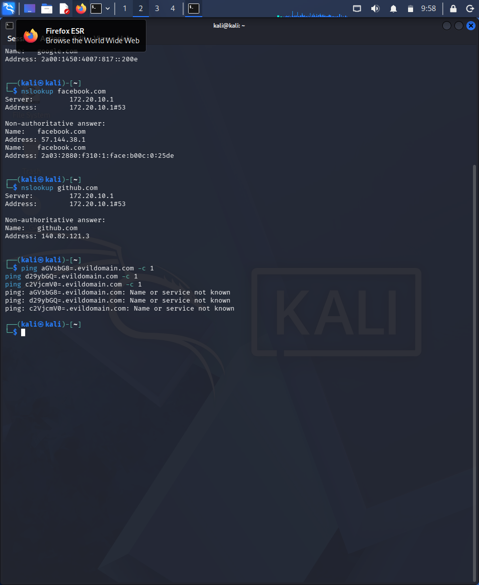

# LAB REPORT — Wireshark DNS Traffic Analysis
===============================================
Analyst:     Odiaka Adebola Favour
Date:        2026-05-20
Environment: Kali Linux — VirtualBox

## Objective
Capture and analyze live DNS traffic using
Wireshark to understand normal DNS behavior,
identify key protocol characteristics, and
recognize suspicious DNS patterns used in
real attacks.

## Environment Setup
- Tool: Wireshark on Kali Linux
- Interface: eth0
- Filter used: dns
- Commands run: ping google.com,
  nslookup google.com,
  nslookup facebook.com,
  nslookup github.com

---

## DNS Traffic Analysis

### Normal DNS Behavior Observed
Using the terminal on Kali Linux, lookups were generated for various domains to capture baseline traffic:

Key observations from raw Wireshark captures:
- Protocol: UDP
- Port: 53
- Each lookup generated 4 packets:
  Query for IPv4 (A record),
  Query for IPv6 (AAAA record),
  Response with IPv4 address,
  Response with IPv6 address
- google.com resolved to 142.251.216.46
- Total packets for 3 lookups: 12

**Why UDP:**
DNS uses UDP because queries are small
and speed matters more than guaranteed
delivery. Failed queries are simply
retried automatically.

---

### Suspicious DNS Pattern — DNS Tunneling

Simulated a malicious DNS data exfiltration scenario by encoding hidden messages inside outgoing subdomains using the terminal:

The traffic structure observed follows this precise pattern:
- `192.168.1.105 → DNS Query: aGVsbG8=.evildomain.com`
- `192.168.1.105 → DNS Query: d29ybGQ=.evildomain.com`
- `192.168.1.105 → DNS Query: c2VjcmV0=.evildomain.com`

**Finding:**
The subdomain names are Base64 encoded strings.
Decoded values:
- `aGVsbG8=`  = "hello"
- `d29ybGQ=`  = "world"
- `c2VjcmV0=` = "secret"

This confirms DNS Tunneling — a technique where
attackers encode stolen data inside DNS
query names and send it out disguised as
normal DNS traffic. Port 53 is frequently
allowed through firewalls without deep
inspection, making it ideal for exfiltration.

**How to spot Base64 in DNS:**
- Subdomains containing only letters,
  numbers, and = signs
- Strings ending with = or ==
- High volume of queries to one domain
- Unusually long subdomain names

---

## Key Takeaways
1. DNS runs on port 53 using UDP. Every
   domain name lookup generates this
   traffic invisibly in the background.
   Understanding normal DNS is essential
   for spotting abnormal DNS.

2. DNS Tunneling hides stolen data inside
   DNS query names using Base64 encoding.
   It bypasses firewalls because port 53
   is almost always allowed through.

3. Base64 encoded strings are identifiable
   by their character set and = padding.
   Seeing them in DNS subdomains is an
   immediate red flag for data exfiltration.

---

## Analyst Conclusion
Normal DNS traffic follows a predictable
pattern of small UDP packets on port 53.
Any deviation — large volumes, encoded
subdomains, or unusual destination domains
— should trigger immediate investigation
as potential DNS tunneling or C2 activity.
